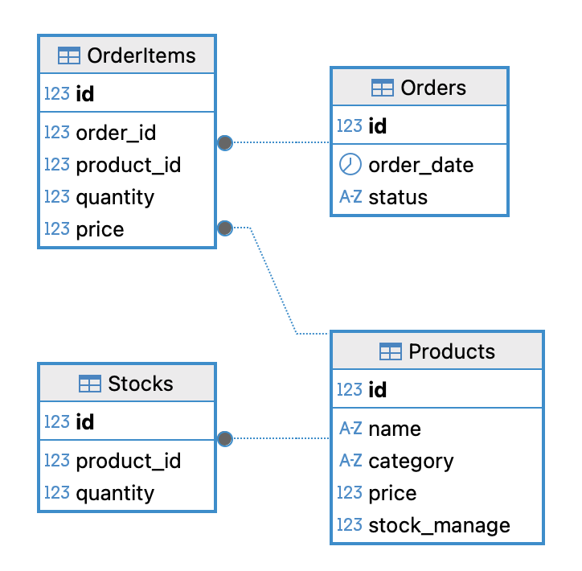

# Swing+DB 미니 프로젝트

## ☕ 카페 재고 관리 프로그램

    1. 상품 관리 - 카페의 상품 저장 (Products)
    2. 재고 관리 - 상품 재고 저장 (Stocks)
    3. 주문 관리 - 주문 정보 저장 (Orders, OrderItems)

## ERD

- dump 데이터: `cafe_dump.sql`
- DB 접속 정보
    - **port: 3307**
    - jdbc:mysql://localhost:3307/cafe
    - user: root
    - password: 1234

## 세부 기능

### 1. 상품 관리

[상품 관리 시연 영상](./img/상품관리.mov)

- 목록
    - 상품의 ID, 상품명, 카테고리, 가격이 표시됨
- 상품 검색
    - 상품명, 카테고리로 검색 가능하며 검색어가 없는 경우 전체 상품 목록이 나타남
    - 검색 초기화 버튼을 누르면 검색어가 초기화 됨
- 상품 추가
    - 추가 버튼을 눌러 상품의 상품명, 카테고리, 가격을 등록할 수 있음
- 상품 수정
    - 수정할 상품의 행을 선택한 뒤, 수정 버튼을 눌러 상품명, 카테고리, 가격을 수정할 수 있음
- 상품 삭제
    - 삭제할 상품의 행을 선택한 뒤, 삭제 버튼을 눌러 상품을 삭제할 수 있음
    - 이미 주문했거나, 재고가 등록되어 있는 경우 삭제 불가함
- 새로고침
    - 검색 목록이 새로 로드됨

### 2. 재고 관리

[재고 관리 시연 영상](./img/재고관리.mov)

- 목록
    - 상품의 상품명, 재고 수량이 표시됨
- 재고 관리 여부 변경
    - 등록한 상품 중, 재고 관리 할 상품을 지정할 수 있음
    - 재고 관리 여부를 ‘예’로 지정하면 현재 재고가 0으로 신규 생성되고, 주문 시 재고가 차감됨
    - 재고 관리 여부를 ‘아니오’로 지정하면 현재 재고가 목록에 보여지지 않음
- 입고
    - 입고 처리할 상품의 행을 선택한 후, 입고 버튼을 누르고, 입력창에서 값을 입력하면 입력 값 만큼 재고가 늘어남
- 폐기
    - 폐기 처리할 상품의 행을 선택한 후, 폐기 버튼을 누르고, 입력창에서 값을 입력하면 입력 값 만큼 재고가 차감됨
- 새로고침
    - 상품 재고 목록이 새로 로드됨

### 3. 주문 관리

[주문 관리 시연 영상](./img/주문관리.mov)

- 목록
    - 선택한 날짜의 주문 목록이 표시됨
    - 주문의 ID, 상태, 주문 상품 개수, 주문 가격 합계가 표시됨
- 날짜 선택
    - 기본 값은 오늘로 지정되어 있음
    - `◀` 버튼으로 이전 날짜로 이동
    - `▶` 버튼으로 다음 날짜로 이동
- 신규 주문
    - 새 주문 추가 창에서 신규 주문을 생성할 수 있음
    - 새 주문 추가 창에 표시된 상품 목록의 오른쪽 열 추가, 감소 칸을 눌러 상품의 주문 수량을 지정할 수 있음
    - 상품을 1개 이상 선택하고 주문 저장 버튼을 누르면 신규 주문이 추가됨
    - 주문한 상품이 재고관리 대상인 경우, 주문 수량 만큼 재고에서 차감됨
- 상세 보기
    - 상세 내용을 확인할 주문 정보 행을 선택한 후, 상세보기 버튼을 눌러 주문 상세 내용 확인 가능함
    - 주문 ID, 주문 상태(주문/준비중/완료), 주문 날짜, 가격 합계, 주문 상품 목록 - 수량, 가격이 표시됨
    - 하단의 상태에서 주문상태를 변경하고, 상태 저장을 누르면 주문의 상태가 변경됨
- 새로고침
    - 주문 목록이 새로 로드됨